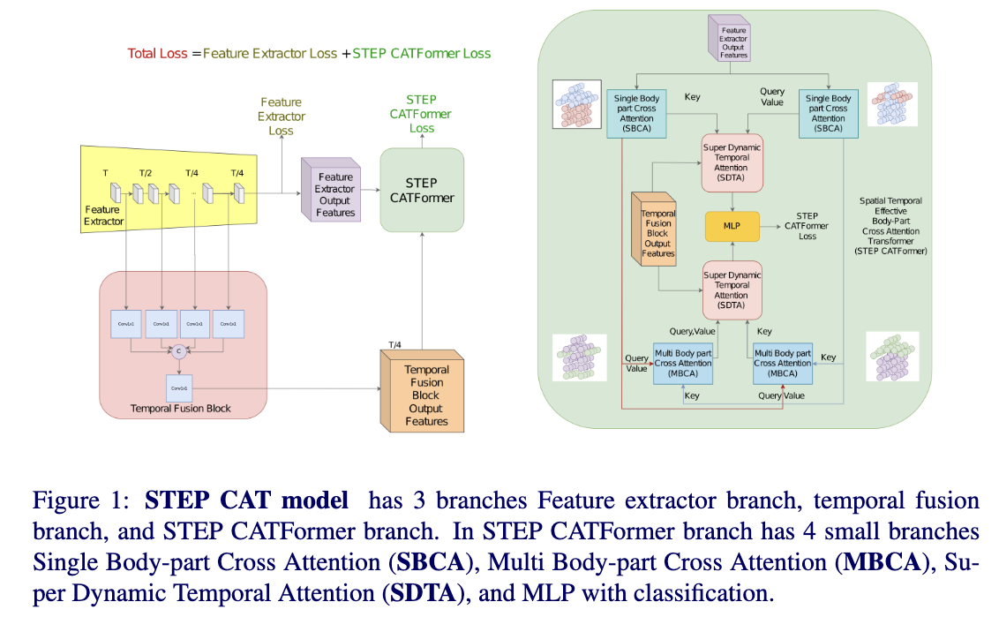

# STEP-CATFormer

This repo is the official implementation for BMVC2023 paper ["STEP CATFormer: Spatial-Temporal Effective Body-Part Cross Attention Transformer for Skeleton-based Action Recognition
"]([https://arxiv.org/abs/2208.05318](https://arxiv.org/abs/2312.03288))

[](https://paperswithcode.com/sota/skeleton-based-action-recognition-on-ntu-rgbd-1?p=step-catformer-spatial-temporal-effective)
[](https://paperswithcode.com/sota/skeleton-based-action-recognition-on-ntu-rgbd?p=step-catformer-spatial-temporal-effective)

## Introduction

   Graph convolutional networks (GCNs) have been widely used and achieved remarkable results in skeleton-based action recognition. We think the key to skeleton-based action recognition is a skeleton hanging in frames, so we focus on how the Graph Convolutional Convolution networks learn different topologies and effectively aggregate joint features in the global temporal and local temporal. In this work, we propose three Channel-wise Tolopogy Graph Convolution based on Channel-wise Topology Refinement Graph Convolution (CTR-GCN). Combining CTR-GCN with two joint cross-attention modules can capture the upper-lower body part and hand-foot relationship skeleton features. After that, to capture features of human skeletons changing in frames we design the Temporal Attention Transformers to extract skeletons effectively. The Temporal Attention Transformers can learn the temporal features of human skeleton sequences. Finally, we fuse the temporal features output scale with MLP and classification. We develop a powerful graph convolutional network named Spatial Temporal Effective Body-part Cross Attention Transformer which notably high-performance on the NTU RGB+D, NTU RGB+D 120 datasets.

## Architecture of STEP CATFormer



# Prerequisites

- Python >= 3.6
- PyTorch >= 1.1.0
- PyYAML, tqdm, tensorboardX


- We provide the dependency file of our experimental environment, you can install all dependencies by creating a new anaconda virtual environment and running `pip install -r requirements.txt `
- Run `pip install -e torchlight` 

# Data Preparation

Please follow [CTR-GCN](https://github.com/Uason-Chen/CTR-GCN) for data preparation

### Download datasets.

#### There are 2 datasets to download:

- NTU RGB+D 60 Skeleton
- NTU RGB+D 120 Skeleton


#### NTU RGB+D 60 and 120

1. Request dataset here: https://rose1.ntu.edu.sg/dataset/actionRecognition
2. Download the skeleton-only datasets:
   1. `nturgbd_skeletons_s001_to_s017.zip` (NTU RGB+D 60)
   2. `nturgbd_skeletons_s018_to_s032.zip` (NTU RGB+D 120)
   3. Extract above files to `./data/nturgbd_raw`


### Data Processing

#### Directory Structure

Put downloaded data into the following directory structure:

```
- data/
  - ntu/
  - ntu120/
  - nturgbd_raw/
    - nturgb+d_skeletons/     # from `nturgbd_skeletons_s001_to_s017.zip`
      ...
    - nturgb+d_skeletons120/  # from `nturgbd_skeletons_s018_to_s032.zip`
      ...
```

#### Generating Data

- Generate NTU RGB+D 60 or NTU RGB+D 120 dataset:

```
 cd ./data/ntu # or cd ./data/ntu120
 # Get skeleton of each performer
 python get_raw_skes_data.py
 # Remove the bad skeleton 
 python get_raw_denoised_data.py
 # Transform the skeleton to the center of the first frame
 python seq_transformation.py
```


# Training & Testing

### Training

- To train model on NTU60/120

```
# Example: training GAP on NTU RGB+D cross subject joint modality
CUDA_VISIBLE_DEVICES=0,1 python main_multipart_ntu.py --config config/nturgbd-cross-subject/lst_joint.yaml --model model.ctrgcn.Model_lst_4part --work-dir work_dir/ntu60/csub/lst_joint --device 0 1
# Example: training GAP on NTU RGB+D cross subject bone modality
CUDA_VISIBLE_DEVICES=0,1 python main_multipart_ntu.py --config config/nturgbd-cross-subject/lst_bone.yaml --model model.ctrgcn.Model_lst_4part_bone --work-dir work_dir/ntu60/csub/lst_bone --device 0 1
# Example: training GAP on NTU RGB+D 120 cross subject joint modality
CUDA_VISIBLE_DEVICES=0,1 python main_multipart_ntu.py --config config/nturgbd120-cross-subject/lst_joint.yaml --model model.ctrgcn.Model_lst_4part --work-dir work_dir/ntu120/csub/lst_joint --device 0 1
# Example: training GAP on NTU RGB+D 120 cross subject bone modality
CUDA_VISIBLE_DEVICES=0,1 python main_multipart_ntu.py --config config/nturgbd120-cross-subject/lst_bone.yaml --model model.ctrgcn.Model_lst_4part_bone --work-dir work_dir/ntu120/csub/lst_bone --device 0 1
```


### Testing

- To test the trained models saved in <work_dir>, run the following command:

```
python main_multipart_ntu.py --config <work_dir>/config.yaml --work-dir <work_dir> --phase test --save-score True --weights <work_dir>/xxx.pt --device 0
```

- To ensemble the results of different modalities, run 
```
# Example: ensemble four modalities of GAP on NTU RGB+D 120 cross subject
python ensemble.py --datasets ntu120/xsub --joint-dir work_dir/ntu120/csub/lst_joint --bone-dir work_dir/ntu120/csub/lst_bone --joint-motion-dir work_dir/ntu120/csub/lst_joint_vel --bone-motion-dir work_dir/ntu120/csub/lst_bone_vel
```

## Acknowledgements

This repo is based on [CTR-GCN](https://github.com/Uason-Chen/CTR-GCN),[GAP](https://github.com/martinxm/gap). The data processing is borrowed from [SGN](https://github.com/microsoft/SGN) and [HCN](https://github.com/huguyuehuhu/HCN-pytorch). The code for different modality is adopted from [InfoGCN](https://github.com/stnoah1/infogcn). The implementation for contrastive loss is adopted from [ActionCLIP](https://github.com/sallymmx/ActionCLIP).

Thanks to the original authors for their work!
